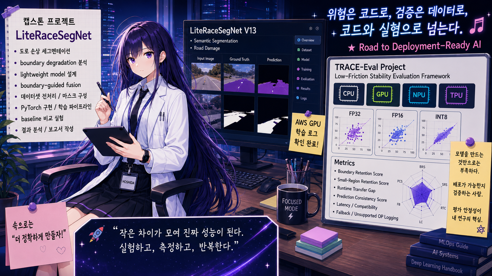

<p align="center">
  
</p>
<p align="center">
  
</p>
# LiteRaceSegNet V13 Three-Region API Extension

JSON-locked three-region visualization extension for LiteRaceSegNet v13.

This repository contains an extension layer for generating three-region road-damage visualization artifacts from LiteRaceSegNet v13 outputs. It preserves the existing legacy-compatible API response contract while adding separate visualization outputs.

## Purpose

This repository does **not** replace the original LiteRaceSegNet v13 project.

It adds a separate post-processing and visualization layer that can generate:

- `crack_mask.png`
- `major_damage_mask.png`
- `suspected_mask.png`
- `three_region_overlay.png`
- `v13_visualization.json`

The existing `result.json` / legacy-compatible API response shape should remain unchanged.

## Repository Roles

| Repository | Role |
|---|---|
| `LiteRaceSegNet-V13-Portal-Clean` | Main v13 reference repository |
| `LiteRaceSegNet-V11` | Legacy JSON / service-summary reference only |
| `LiteRaceSegNet-V13-ThreeRegion-API-Extension` | Three-region visualization extension |

The v11 repository is not modified.  
The v13 main repository is not directly modified.  
This repository contains only the extension layer.

## Visualization Meaning

| Color | Meaning |
|---|---|
| Cyan / Turquoise | Crack-like thin structure |
| Red | Pothole or major damage blob |
| Yellow | Suspected or uncertain candidate area |

These regions are generated through post-processing from the existing v13 binary road-damage segmentation output.

This does **not** mean the current v13 model directly predicts three semantic classes. The current implementation is a research/capstone prototype visualization extension based on binary segmentation.

## JSON Contract Policy

The existing API response contract is preserved.

This extension should not change:

- existing `result.json` structure
- existing field names
- existing field types
- existing nesting structure
- existing `files.mask_path`
- existing `files.overlay_path`
- existing `files.evidence_json_path`

The three-region result is stored separately as:

```text
runtime_api/requests/<request_id>/v13_visualization.json
```

and may be served through a separate extension endpoint such as:

```text
GET /api/v1/results/{request_id}/v13-visualization
```

## Safety and Limitation

This repository is intended for academic, capstone, and prototype demonstration use.

The output is not a certified road safety diagnosis. It should not be used alone for maintenance priority decisions, legal judgment, insurance evaluation, or administrative decision-making.

## Reference Repositories

Main v13 reference:

```text
https://github.com/jcicaaa3-cloud/LiteRaceSegNet-V13-Portal-Clean
```

Legacy v11 reference:

```text
https://github.com/jcicaaa3-cloud/LiteRaceSegNet-V11
```

Extension repository:

```text
https://github.com/jcicaaa3-cloud/LiteRaceSegNet-V13-ThreeRegion-API-Extension
```


